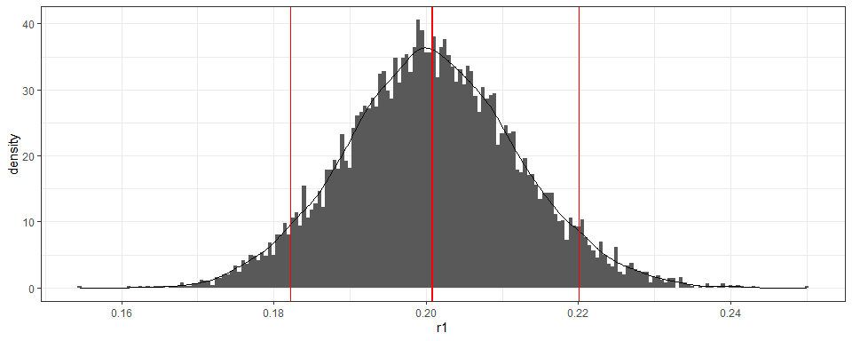
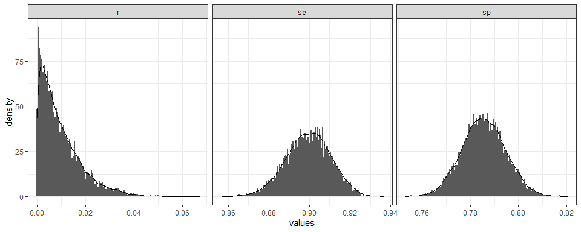

<!-- README.md is generated from README.Rmd. Please edit that file -->

# serosurvey

<!-- badges: start -->

[](https://www.tidyverse.org/lifecycle/#experimental)
[](https://cran.r-project.org/package=serosurvey)
<!-- badges: end -->

The goal of `serosurvey` is to gather *functions* and *workflow
templates* for **Serological Survey Analysis For Prevalence Estimation
Under Misclassification**.

## Installation

<!-- You can install the released version of serosurvey from [CRAN](https://CRAN.R-project.org) with: -->

``` r
if(!require("devtools")) install.packages("devtools")
devtools::install_github("avallecam/serosurvey")
```

## Example

This is a basic example which shows you how to solve a common problem:

``` r
library(serosurvey)
```

### `survey`: Estimate single prevalences

  - From a **`srvyr` survey design object**, **`serosvy_proportion`**
    estimates:
    
      - weighted prevalence (`prop`),
      - total population (`total`),
      - raw proportion (`raw_prop`),
      - coefficient of variability (`cv`),
      - design effect (`deff`)

<!-- end list -->

``` r
serosvy_proportion(design = design,
                   denominator = covariate_01,
                   numerator = outcome_one)
#> # A tibble: 6 x 23
#>   denominator denominator_lev~ numerator numerator_level  prop prop_low
#>   <chr>       <fct>            <chr>     <fct>           <dbl>    <dbl>
#> 1 covariate_~ E                outcome_~ No              0.211   0.130 
#> 2 covariate_~ E                outcome_~ Yes             0.789   0.675 
#> 3 covariate_~ H                outcome_~ No              0.852   0.564 
#> 4 covariate_~ H                outcome_~ Yes             0.148   0.0377
#> 5 covariate_~ M                outcome_~ No              0.552   0.224 
#> 6 covariate_~ M                outcome_~ Yes             0.448   0.160 
#> # ... with 17 more variables: prop_upp <dbl>, prop_cv <dbl>,
#> #   prop_se <dbl>, total <dbl>, total_low <dbl>, total_upp <dbl>,
#> #   total_cv <dbl>, total_se <dbl>, total_deff <dbl>, total_den <dbl>,
#> #   total_den_low <dbl>, total_den_upp <dbl>, raw_num <int>,
#> #   raw_den <int>, raw_prop <dbl>, raw_prop_low <dbl>, raw_prop_upp <dbl>


serosvy_proportion(design = design,
                   denominator = outcome_one,
                   numerator = covariate_01)
#> # A tibble: 6 x 23
#>   denominator denominator_lev~ numerator numerator_level   prop prop_low
#>   <chr>       <fct>            <chr>     <fct>            <dbl>    <dbl>
#> 1 outcome_one No               covariat~ E               0.400    0.216 
#> 2 outcome_one No               covariat~ H               0.318    0.117 
#> 3 outcome_one No               covariat~ M               0.283    0.150 
#> 4 outcome_one Yes              covariat~ E               0.840    0.712 
#> 5 outcome_one Yes              covariat~ H               0.0311   0.0105
#> 6 outcome_one Yes              covariat~ M               0.129    0.0633
#> # ... with 17 more variables: prop_upp <dbl>, prop_cv <dbl>,
#> #   prop_se <dbl>, total <dbl>, total_low <dbl>, total_upp <dbl>,
#> #   total_cv <dbl>, total_se <dbl>, total_deff <dbl>, total_den <dbl>,
#> #   total_den_low <dbl>, total_den_upp <dbl>, raw_num <int>,
#> #   raw_den <int>, raw_prop <dbl>, raw_prop_low <dbl>, raw_prop_upp <dbl>
```

``` r
example("serosvy_proportion")
```

### `survey`: Estimate multiple prevalences

  - In the [Article
    tab](https://avallecam.github.io/serosurvey/articles/howto-reprex.html)
    we provide a workflow to **estimate multiple prevalences**:
    
      - using *different set of covariates* and outcomes as numerators
        or denominators,
      - in *one single pipe* operation

<!-- end list -->

``` r
# crear matriz
  #
  # set 01 of denominator-numerator
  #
expand_grid(
  design=list(design),
  denominator=c("covariate_01","covariate_02"), # covariates
  numerator=c("outcome_one","outcome_two") # outcomes
  ) %>% 
  #
  # set 02 of denominator-numerator (e.g. within main outcome)
  #
  union_all(
    expand_grid(
      design=list(design),
      denominator=c("outcome_one","outcome_two"), # outcomes
      numerator=c("covariate_02") # covariates
    )
  ) %>% 
  #
  # create symbols (to be readed as arguments)
  #
  mutate(
    denominator=map(denominator,dplyr::sym),
    numerator=map(numerator,dplyr::sym)
  ) %>% 
  #
  # estimate prevalence
  #
  mutate(output=pmap(.l = select(.,design,denominator,numerator),
                     .f = serosvy_proportion)) %>% 
  #
  # show the outcome
  #
  select(-design,-denominator,-numerator) %>% 
  unnest(cols = c(output)) %>% 
  print(n=Inf)
#> # A tibble: 25 x 23
#>    denominator denominator_lev~ numerator numerator_level   prop prop_low
#>    <chr>       <fct>            <chr>     <fct>            <dbl>    <dbl>
#>  1 covariate_~ E                outcome_~ No              0.211   0.130  
#>  2 covariate_~ E                outcome_~ Yes             0.789   0.675  
#>  3 covariate_~ H                outcome_~ No              0.852   0.564  
#>  4 covariate_~ H                outcome_~ Yes             0.148   0.0377 
#>  5 covariate_~ M                outcome_~ No              0.552   0.224  
#>  6 covariate_~ M                outcome_~ Yes             0.448   0.160  
#>  7 covariate_~ E                outcome_~ (-0.1,50]       0.182   0.0499 
#>  8 covariate_~ E                outcome_~ (50,100]        0.818   0.515  
#>  9 covariate_~ H                outcome_~ (-0.1,50]       0.0769  0.00876
#> 10 covariate_~ H                outcome_~ (50,100]        0.923   0.560  
#> 11 covariate_~ M                outcome_~ (50,100]        1.00    1.00   
#> 12 covariate_~ No               outcome_~ No              1.00    1.00   
#> 13 covariate_~ Yes              outcome_~ No              0.0334  0.00884
#> 14 covariate_~ Yes              outcome_~ Yes             0.967   0.882  
#> 15 covariate_~ No               outcome_~ (-0.1,50]       0.218   0.0670 
#> 16 covariate_~ No               outcome_~ (50,100]        0.782   0.479  
#> 17 covariate_~ Yes              outcome_~ (-0.1,50]       0.0914  0.0214 
#> 18 covariate_~ Yes              outcome_~ (50,100]        0.909   0.684  
#> 19 outcome_one No               covariat~ No              0.939   0.778  
#> 20 outcome_one No               covariat~ Yes             0.0615  0.0148 
#> 21 outcome_one Yes              covariat~ Yes             1.00    1.00   
#> 22 outcome_two (-0.1,50]        covariat~ No              0.549   0.294  
#> 23 outcome_two (-0.1,50]        covariat~ Yes             0.451   0.219  
#> 24 outcome_two (50,100]         covariat~ No              0.305   0.188  
#> 25 outcome_two (50,100]         covariat~ Yes             0.695   0.546  
#> # ... with 17 more variables: prop_upp <dbl>, prop_cv <dbl>,
#> #   prop_se <dbl>, total <dbl>, total_low <dbl>, total_upp <dbl>,
#> #   total_cv <dbl>, total_se <dbl>, total_deff <dbl>, total_den <dbl>,
#> #   total_den_low <dbl>, total_den_upp <dbl>, raw_num <int>,
#> #   raw_den <int>, raw_prop <dbl>, raw_prop_low <dbl>, raw_prop_upp <dbl>
```

### `serology`: Estimate prevalence Under misclassification

  - We gather **classical frequentist approaches** to deal with
    misclassification due to an imperfect diagnostic test. Check the
    [functions documentation
    tab](https://avallecam.github.io/serosurvey/reference/index.html).

  - We provide **tidy outputs for bayesian approaches** developed in
    Daniel B. Larremore et al. ([2020](#ref-Larremore2020unk))
    [here](https://github.com/LarremoreLab/bayesian-joint-prev-se-sp/blob/master/singleSERO_uncertainTEST.R)
    and Daniel B Larremore et al. ([2020](#ref-Larremore2020kno))
    [here](https://github.com/LarremoreLab/covid_serological_sampling/blob/master/codebase/seroprevalence.R):

  - You can use them with **`purrr`** and **`furrr`** to efficiently
    iterate and parallelize this step for **multiple prevalences in one
    single pipe**. Check the workflow in [Article
    tab](https://avallecam.github.io/serosurvey/articles/howto-reprex.html).

#### **Known test performance - Bayesian method**

``` r
tidy_result <- serosvy_known_sample_posterior(
  #in population
  positive_number_test = 321,
  total_number_test = 321+1234,
  # known performance
  sensitivity = 0.93,
  specificity = 0.975
)
```



``` r
example("serosvy_known_sample_posterior")
```

#### **Unknown test preformance - Bayesian method**

  - The test performance is defined as *unknown* or *uncertain* “when
    the test characteristics are not well defined and a limited number
    of test are available, such as during an outbreak of a novel
    pathogen.” (Daniel B. Larremore et al.
    [2020](#ref-Larremore2020unk); Diggle [2011](#ref-Diggle2011))

<!-- end list -->

``` r
result_unk <- serosvy_unknown_sample_posterior_ii(
  #in population
  positive_number_test = 321,
  total_number_test = 321+1234,
  # in lab (local validation study)
  true_positive = 670,
  true_negative = 640,
  false_positive = 202,
  false_negative = 74)
```



``` r
example("serosvy_unknown_sample_posterior")
```

## Contribute

Feel free to fill an issue or contribute with your functions or
workflows.

Here are two articles with interesting approaches using R:

  - Silveira et al. ([2020](#ref-Silveira2020)) in the strategy 3
    analysed the survey accounting for sampling design and test validity
    using parametric bootstraping.

  - Flor et al. ([2020](#ref-Flor2020)) implemented a lot of frequentist
    and bayesian methods for test with known sensitivity and
    specificity. Code is available
    [here](https://github.com/BfRstats/bayespem-validation-code)

## References

<div id="refs">

<div id="ref-Diggle2011">

Diggle, Peter J. 2011. “Estimating Prevalence Using an Imperfect Test.”
*Epidemiology Research International* 2011: 1–5.
<https://doi.org/10.1155/2011/608719>.

</div>

<div id="ref-Flor2020">

Flor, Matthias, Michael Weiß, Thomas Selhorst, Christine Müller-Graf,
and Matthias Greiner. 2020. “Comparison of Bayesian and Frequentist
Methods for Prevalence Estimation Under Misclassification.” *BMC Public
Health* 20 (1). <https://doi.org/10.1186/s12889-020-09177-4>.

</div>

<div id="ref-Larremore2020kno">

Larremore, Daniel B, Bailey K Fosdick, Kate M Bubar, Sam Zhang, Stephen
M Kissler, C. Jessica E. Metcalf, Caroline Buckee, and Yonatan Grad.
2020. “Estimating SARS-CoV-2 Seroprevalence and Epidemiological
Parameters with Uncertainty from Serological Surveys,” April.
<https://doi.org/10.1101/2020.04.15.20067066>.

</div>

<div id="ref-Larremore2020unk">

Larremore, Daniel B., Bailey K. Fosdick, Sam Zhang, and Yonatan H. Grad.
2020. “Jointly Modeling Prevalence, Sensitivity and Specificity for
Optimal Sample Allocation,” May.
<https://doi.org/10.1101/2020.05.23.112649>.

</div>

<div id="ref-Silveira2020">

Silveira, Mariângela F., Aluı́sio J. D. Barros, Bernardo L. Horta, Lúcia
C. Pellanda, Gabriel D. Victora, Odir A. Dellagostin, Claudio J.
Struchiner, et al. 2020. “Population-Based Surveys of Antibodies Against
SARS-CoV-2 in Southern Brazil.” *Nature Medicine* 26 (8): 1196–9.
<https://doi.org/10.1038/s41591-020-0992-3>.

</div>

</div>

## How to cite this R package

``` r
citation("serosurvey")
#> 
#> To cite package 'serosurvey' in publications use:
#> 
#>   Andree Valle Campos (2020). serosurvey: Serological Survey
#>   Analysis For Prevalence Estimation Under Misclassification. R
#>   package version 0.0.0.9000.
#>   https://avallecam.github.io/serosurvey/
#> 
#> A BibTeX entry for LaTeX users is
#> 
#>   @Manual{,
#>     title = {serosurvey: Serological Survey Analysis For Prevalence Estimation Under Misclassification},
#>     author = {Andree {Valle Campos}},
#>     year = {2020},
#>     note = {R package version 0.0.0.9000},
#>     url = {https://avallecam.github.io/serosurvey/},
#>   }
```
