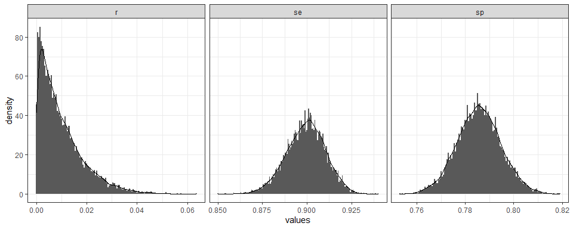

<!-- README.md is generated from README.Rmd. Please edit that file -->

# serosurvey

<!-- badges: start -->

[](https://www.tidyverse.org/lifecycle/#experimental)
[](https://cran.r-project.org/package=serosurvey)
<!-- badges: end -->

The goal of `serosurvey` is to provide a centralized R package of
Serological Survey Analysis For Prevalence Estimation Under
Misclassification

## Installation

<!-- You can install the released version of serosurvey from [CRAN](https://CRAN.R-project.org) with: -->

``` r
if(!require("devtools")) install.packages("devtools")
devtools::install_github("avallecam/serosurvey")
```

## Example

This is a basic example which shows you how to solve a common problem:

``` r
library(serosurvey)
```

### `survey`: Estimate single prevalences

  - **`serosvy_proportion`** estimates **prevalence, total population,
    raw proportions, cv%, deff** from a `srvyr` survey design object in
    one single function:

<!-- end list -->

``` r
serosvy_proportion(design = design,
                      denominator = stype,
                      numerator = awards)
#> # A tibble: 6 x 23
#>   denominator denominator_lev~ numerator numerator_level  prop prop_low
#>   <chr>       <fct>            <chr>     <fct>           <dbl>    <dbl>
#> 1 stype       E                awards    No              0.211   0.130 
#> 2 stype       E                awards    Yes             0.789   0.675 
#> 3 stype       H                awards    No              0.852   0.564 
#> 4 stype       H                awards    Yes             0.148   0.0377
#> 5 stype       M                awards    No              0.552   0.224 
#> 6 stype       M                awards    Yes             0.448   0.160 
#> # ... with 17 more variables: prop_upp <dbl>, prop_cv <dbl>,
#> #   prop_se <dbl>, total <dbl>, total_low <dbl>, total_upp <dbl>,
#> #   total_cv <dbl>, total_se <dbl>, total_deff <dbl>, total_den <dbl>,
#> #   total_den_low <dbl>, total_den_upp <dbl>, raw_num <int>,
#> #   raw_den <int>, raw_prop <dbl>, raw_prop_low <dbl>, raw_prop_upp <dbl>


serosvy_proportion(design = design,
                      denominator = awards,
                      numerator = stype)
#> # A tibble: 6 x 23
#>   denominator denominator_lev~ numerator numerator_level   prop prop_low
#>   <chr>       <fct>            <chr>     <fct>            <dbl>    <dbl>
#> 1 awards      No               stype     E               0.400    0.216 
#> 2 awards      No               stype     H               0.318    0.117 
#> 3 awards      No               stype     M               0.283    0.150 
#> 4 awards      Yes              stype     E               0.840    0.712 
#> 5 awards      Yes              stype     H               0.0311   0.0105
#> 6 awards      Yes              stype     M               0.129    0.0633
#> # ... with 17 more variables: prop_upp <dbl>, prop_cv <dbl>,
#> #   prop_se <dbl>, total <dbl>, total_low <dbl>, total_upp <dbl>,
#> #   total_cv <dbl>, total_se <dbl>, total_deff <dbl>, total_den <dbl>,
#> #   total_den_low <dbl>, total_den_upp <dbl>, raw_num <int>,
#> #   raw_den <int>, raw_prop <dbl>, raw_prop_low <dbl>, raw_prop_upp <dbl>
```

``` r
example("serosvy_proportion")
```

### `survey`: Estimate multiple prevalences

  - In
    [articles](https://avallecam.github.io/serosurvey/articles/howto-reprex.html)
    we provide a workflow to **estimate multiple prevalences** in one
    single pipe operation:

<!-- end list -->

``` r
# crear matriz
  # set 01 of denominator-numerator
  expand_grid(
    design=list(design),
    denominator=covariate_set01,
    numerator=c("awards","outcome_two")
  ) %>% 
  # set 02 of denominator-numerator (e.g. within main outcome)
  union_all(
    expand_grid(
      design=list(design),
      denominator=c("awards","outcome_two"),
      numerator=covariate_set02
    )
  ) %>% 
  # crear simbolos
  mutate(
    denominator=map(denominator,dplyr::sym),
    numerator=map(numerator,dplyr::sym)
  ) %>% 
  # estimar prevalencia
  
  mutate(output=pmap(.l = select(.,design,denominator,numerator),
                     .f = serosvy_proportion)) %>% 
  
  # mutate(output=map(.x = output,.f = tidy_srvyr_tibble)) %>% 
  select(-design,-denominator,-numerator) %>% 
  unnest(cols = c(output)) %>% 
  print(n=Inf)
#> # A tibble: 25 x 23
#>    denominator denominator_lev~ numerator numerator_level   prop prop_low
#>    <chr>       <fct>            <chr>     <fct>            <dbl>    <dbl>
#>  1 stype       E                awards    No              0.211   0.130  
#>  2 stype       E                awards    Yes             0.789   0.675  
#>  3 stype       H                awards    No              0.852   0.564  
#>  4 stype       H                awards    Yes             0.148   0.0377 
#>  5 stype       M                awards    No              0.552   0.224  
#>  6 stype       M                awards    Yes             0.448   0.160  
#>  7 stype       E                outcome_~ (-0.1,50]       0.182   0.0499 
#>  8 stype       E                outcome_~ (50,100]        0.818   0.515  
#>  9 stype       H                outcome_~ (-0.1,50]       0.0769  0.00876
#> 10 stype       H                outcome_~ (50,100]        0.923   0.560  
#> 11 stype       M                outcome_~ (50,100]        1.00    1.00   
#> 12 both        No               awards    No              1.00    1.00   
#> 13 both        Yes              awards    No              0.0334  0.00884
#> 14 both        Yes              awards    Yes             0.967   0.882  
#> 15 both        No               outcome_~ (-0.1,50]       0.218   0.0670 
#> 16 both        No               outcome_~ (50,100]        0.782   0.479  
#> 17 both        Yes              outcome_~ (-0.1,50]       0.0914  0.0214 
#> 18 both        Yes              outcome_~ (50,100]        0.909   0.684  
#> 19 awards      No               both      No              0.939   0.778  
#> 20 awards      No               both      Yes             0.0615  0.0148 
#> 21 awards      Yes              both      Yes             1.00    1.00   
#> 22 outcome_two (-0.1,50]        both      No              0.549   0.294  
#> 23 outcome_two (-0.1,50]        both      Yes             0.451   0.219  
#> 24 outcome_two (50,100]         both      No              0.305   0.188  
#> 25 outcome_two (50,100]         both      Yes             0.695   0.546  
#> # ... with 17 more variables: prop_upp <dbl>, prop_cv <dbl>,
#> #   prop_se <dbl>, total <dbl>, total_low <dbl>, total_upp <dbl>,
#> #   total_cv <dbl>, total_se <dbl>, total_deff <dbl>, total_den <dbl>,
#> #   total_den_low <dbl>, total_den_upp <dbl>, raw_num <int>,
#> #   raw_den <int>, raw_prop <dbl>, raw_prop_low <dbl>, raw_prop_upp <dbl>
```

### `serology`: Estimate prevalence Under misclassification

  - We provide a **tidy outputs** for open source funtions to consider
    **misclassification due to an imperfect diagnostic test**:

#### **Known test performance - Bayesian method**

``` r
tidy_result <- serosvy_known_sample_posterior(
  positive_number_test = 321,
  total_number_test = 321+1234,
  # known performance
  sensitivity = 0.93,
  specificity = 0.975
)
```


``` r
example("serosvy_known_sample_posterior")
```

#### **Unknown test preformance - Bayesian method**

``` r
result_unk <- sample_posterior_r_mcmc_testun(samps = 10000,
                                             #in population
                                             pos = 692, #positive
                                             n = 3212, #total
                                             # in lab (local validation study)
                                             tp = 670,tn = 640,fp = 202,fn = 74)
```



``` r
example("serosvy_unknown_sample_posterior")
```

### `purrr`: Iterate and parallelize the calculations

  - **Use `purrr` and `furrr`** to efficiently update prevalence
    posterior distributions for multiple prevalences in one pipe:

<!-- end list -->

``` r
library(purrr)
library(furrr)
# library(tictoc)

plan(multisession, workers = availableCores())
# tic()
result <- tibble(
  g=1:2,
  p=seq(10L,20L,10L),
  n=seq(200L,100L,-100L),
  se=seq(0.9,0.8,-0.1),
  sp=seq(0.8,0.9,0.1)
) %>%
  # mutate(fix=pmap(.l = select(.,
  mutate(fix=future_pmap(
    .l = select(.,
                positive_number_test=p,
                total_number_test=n,
                sensitivity=se,
                specificity=sp),
    .f = possibly(serosvy_known_sample_posterior,
                  otherwise = NA_real_)))
# toc()

result %>%
  unnest(fix) %>%
  unnest(summary)
#> # A tibble: 2 x 11
#>       g     p     n    se    sp posterior skim_variable numeric.p05
#>   <int> <int> <int> <dbl> <dbl> <list>    <chr>               <dbl>
#> 1     1    10   200   0.9   0.8 <tibble ~ r1             0.00000198
#> 2     2    20   100   0.8   0.9 <tibble ~ r1             0.0618    
#> # ... with 3 more variables: numeric.mean <dbl>, numeric.p50 <dbl>,
#> #   numeric.p95 <dbl>
```

## Contribute

Feel free to fill an issue or contribute with your functions or
workflows.

Here are two articles with interesting approaches using R:

  - Silveira et al (2020) in the strategy 3 analysed the survey
    accounting for sampling design and test validity using parametric
    bootstraping:

> Silveira, M. F., Barros, A. J., Horta, B. L., Pellanda, L. C.,
> Victora, G. D., Dellagostin, O. A., … & Mesa, J. M. (2020).
> Population-based surveys of antibodies against SARS-CoV-2 in Southern
> Brazil. Nature Medicine, 26(8), 1196-1199. doi:
> <https://doi.org/10.1038/s41591-020-0992-3>

  - Flor et al. (2020) implemented a lot of frequentist and bayesian
    methods for test with known sensitivity and specificity

> Flor, M., Weiβ, M., Selhorst, T., Müller-Graf, C., & Greiner, M.
> (2020). Comparison of Bayesian and frequentist methods for prevalence
> estimation under misclassification. doi:
> <https://doi.org/10.1186/s12889-020-09177-4>

## Citation

``` r
citation("serosurvey")
#> 
#> To cite package 'serosurvey' in publications use:
#> 
#>   Andree Valle Campos (2020). serosurvey: Serological Survey
#>   Analysis For Prevalence Estimation Under Misclassification. R
#>   package version 0.0.0.9000.
#>   https://avallecam.github.io/serosurvey/
#> 
#> A BibTeX entry for LaTeX users is
#> 
#>   @Manual{,
#>     title = {serosurvey: Serological Survey Analysis For Prevalence Estimation Under Misclassification},
#>     author = {Andree {Valle Campos}},
#>     year = {2020},
#>     note = {R package version 0.0.0.9000},
#>     url = {https://avallecam.github.io/serosurvey/},
#>   }
```
