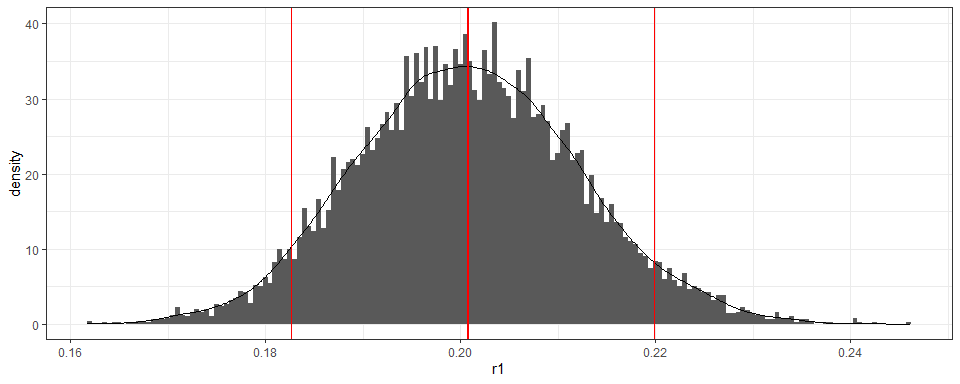

<!-- README.md is generated from README.Rmd. Please edit that file -->

# serosurvey

<!-- badges: start -->

[](https://www.tidyverse.org/lifecycle/#experimental)
[](https://cran.r-project.org/package=serosurvey)
<!-- badges: end -->

The goal of `serosurvey` is to gather **Serological Survey Analysis**
functions and workflow templates for **Prevalence Estimation Under
Misclassification**.

## Installation

<!-- You can install the released version of serosurvey from [CRAN](https://CRAN.R-project.org) with: -->

``` r
if(!require("remotes")) install.packages("remotes")
remotes::install_github("avallecam/serosurvey")
```

## Example

Three basic examples which shows you how to solve common problems:

``` r
library(serosurvey)
```

### 1\. `survey`: Estimate single prevalences

  - From a [`srvyr`](http://gdfe.co/srvyr/) **survey design object**,
    **`serosvy_proportion`** estimates:
    
      - weighted prevalence (`prop`),
      - total population (`total`),
      - raw proportion (`raw_prop`),
      - coefficient of variability (`cv`),
      - design effect (`deff`)

<!-- end list -->

``` r
serosvy_proportion(design = design,
                   denominator = covariate_01,
                   numerator = outcome_one)
#> # A tibble: 6 x 23
#>   denominator denominator_lev~ numerator numerator_level  prop prop_low
#>   <chr>       <fct>            <chr>     <fct>           <dbl>    <dbl>
#> 1 covariate_~ E                outcome_~ No              0.211   0.130 
#> 2 covariate_~ E                outcome_~ Yes             0.789   0.675 
#> 3 covariate_~ H                outcome_~ No              0.852   0.564 
#> 4 covariate_~ H                outcome_~ Yes             0.148   0.0377
#> 5 covariate_~ M                outcome_~ No              0.552   0.224 
#> 6 covariate_~ M                outcome_~ Yes             0.448   0.160 
#> # ... with 17 more variables: prop_upp <dbl>, prop_cv <dbl>,
#> #   prop_se <dbl>, total <dbl>, total_low <dbl>, total_upp <dbl>,
#> #   total_cv <dbl>, total_se <dbl>, total_deff <dbl>, total_den <dbl>,
#> #   total_den_low <dbl>, total_den_upp <dbl>, raw_num <int>,
#> #   raw_den <int>, raw_prop <dbl>, raw_prop_low <dbl>, raw_prop_upp <dbl>
```

``` r
example("serosvy_proportion")
```

### 2\. `survey`: Estimate multiple prevalences

  - In the [Article
    tab](https://avallecam.github.io/serosurvey/articles/howto-reprex.html)
    we provide a workflow to **estimate multiple prevalences**:
    
      - using different set of covariates and outcomes as numerators or
        denominators,
      - in one single pipe operation

<!-- end list -->

``` r
# crear matriz
  #
  # set 01 of denominator-numerator
  #
expand_grid(
  design=list(design),
  denominator=c("covariate_01","covariate_02"), # covariates
  numerator=c("outcome_one","outcome_two") # outcomes
  ) %>% 
  #
  # set 02 of denominator-numerator (e.g. within main outcome)
  #
  union_all(
    expand_grid(
      design=list(design),
      denominator=c("outcome_one","outcome_two"), # outcomes
      numerator=c("covariate_02") # covariates
    )
  ) %>% 
  #
  # create symbols (to be readed as arguments)
  #
  mutate(
    denominator=map(denominator,dplyr::sym),
    numerator=map(numerator,dplyr::sym)
  ) %>% 
  #
  # estimate prevalence
  #
  mutate(output=pmap(.l = select(.,design,denominator,numerator),
                     .f = serosvy_proportion)) %>% 
  #
  # show the outcome
  #
  select(-design,-denominator,-numerator) %>% 
  unnest(cols = c(output)) %>% 
  print(n=Inf)
#> # A tibble: 25 x 23
#>    denominator denominator_lev~ numerator numerator_level   prop prop_low
#>    <chr>       <fct>            <chr>     <fct>            <dbl>    <dbl>
#>  1 covariate_~ E                outcome_~ No              0.211   0.130  
#>  2 covariate_~ E                outcome_~ Yes             0.789   0.675  
#>  3 covariate_~ H                outcome_~ No              0.852   0.564  
#>  4 covariate_~ H                outcome_~ Yes             0.148   0.0377 
#>  5 covariate_~ M                outcome_~ No              0.552   0.224  
#>  6 covariate_~ M                outcome_~ Yes             0.448   0.160  
#>  7 covariate_~ E                outcome_~ (-0.1,50]       0.182   0.0499 
#>  8 covariate_~ E                outcome_~ (50,100]        0.818   0.515  
#>  9 covariate_~ H                outcome_~ (-0.1,50]       0.0769  0.00876
#> 10 covariate_~ H                outcome_~ (50,100]        0.923   0.560  
#> 11 covariate_~ M                outcome_~ (50,100]        1.00    1.00   
#> 12 covariate_~ No               outcome_~ No              1.00    1.00   
#> 13 covariate_~ Yes              outcome_~ No              0.0334  0.00884
#> 14 covariate_~ Yes              outcome_~ Yes             0.967   0.882  
#> 15 covariate_~ No               outcome_~ (-0.1,50]       0.218   0.0670 
#> 16 covariate_~ No               outcome_~ (50,100]        0.782   0.479  
#> 17 covariate_~ Yes              outcome_~ (-0.1,50]       0.0914  0.0214 
#> 18 covariate_~ Yes              outcome_~ (50,100]        0.909   0.684  
#> 19 outcome_one No               covariat~ No              0.939   0.778  
#> 20 outcome_one No               covariat~ Yes             0.0615  0.0148 
#> 21 outcome_one Yes              covariat~ Yes             1.00    1.00   
#> 22 outcome_two (-0.1,50]        covariat~ No              0.549   0.294  
#> 23 outcome_two (-0.1,50]        covariat~ Yes             0.451   0.219  
#> 24 outcome_two (50,100]         covariat~ No              0.305   0.188  
#> 25 outcome_two (50,100]         covariat~ Yes             0.695   0.546  
#> # ... with 17 more variables: prop_upp <dbl>, prop_cv <dbl>,
#> #   prop_se <dbl>, total <dbl>, total_low <dbl>, total_upp <dbl>,
#> #   total_cv <dbl>, total_se <dbl>, total_deff <dbl>, total_den <dbl>,
#> #   total_den_low <dbl>, total_den_upp <dbl>, raw_num <int>,
#> #   raw_den <int>, raw_prop <dbl>, raw_prop_low <dbl>, raw_prop_upp <dbl>
```

### 3\. `serology`: Estimate prevalence Under misclassification

  - We gather **one frequentist approach** (Rogan and Gladen
    [1978](#ref-ROGAN1978)), available in different Github repos, that
    deal with misclassification due to an imperfect diagnostic test
    (Azman et al. [2020](#ref-Azman2020); Takahashi, Greenhouse, and
    Rodríguez-Barraquer [2020](#ref-Takahashi2020)). Check the
    [Reference
    tab](https://avallecam.github.io/serosurvey/reference/index.html).

  - We provide **tidy outputs for bayesian approaches** developed in
    Daniel B. Larremore et al. ([2020](#ref-Larremore2020unk))
    [here](https://github.com/LarremoreLab/bayesian-joint-prev-se-sp/blob/master/singleSERO_uncertainTEST.R)
    and Daniel B Larremore et al. ([2020](#ref-Larremore2020kno))
    [here](https://github.com/LarremoreLab/covid_serological_sampling/blob/master/codebase/seroprevalence.R):

  - You can use them with [`purrr`](https://purrr.tidyverse.org/) and
    [`furrr`](https://davisvaughan.github.io/furrr/) to efficiently
    iterate and parallelize this step for **multiple prevalences**.
    Check the workflow in [Article
    tab](https://avallecam.github.io/serosurvey/articles/howto-reprex.html).

#### **Known test performance - Bayesian method**

``` r
serosvy_known_sample_posterior(
  #in population
  positive_number_test = 321,
  total_number_test = 321+1234,
  # known performance
  sensitivity = 0.93,
  specificity = 0.975
)
```



``` r
example("serosvy_known_sample_posterior")
```

#### **Unknown test performance - Bayesian method**

  - The test performance is called *“unknown”* or *“uncertain”* when
    test sensitivity and specificity are not known with certainty
    (Kritsotakis [2020](#ref-Kritsotakis2020); Diggle
    [2011](#ref-Diggle2011); Gelman and Carpenter
    [2020](#ref-Gelman2020)) and lab validation data is available with a
    limited set of samples, tipically during a novel pathogen outbreak.

<!-- end list -->

``` r
serosvy_unknown_sample_posterior_ii(
  #in population
  positive_number_test = 321,
  total_number_test = 321+1234,
  # in lab (local validation study)
  true_positive = 670,
  true_negative = 640,
  false_positive = 202,
  false_negative = 74)
```


``` r
example("serosvy_unknown_sample_posterior")
```

## Contributing

Feel free to fill an issue or contribute with your functions or
workflows in a pull request.

Here are a list of publications with interesting approaches using R:

  - Silveira et al. ([2020](#ref-Silveira2020)) and Hallal et al.
    ([2020](#ref-Hallal2020)) analysed a serological survey accounting
    for sampling design and test validity using parametric bootstraping,
    following Lewis and Torgerson ([2012](#ref-Lewis2012)).

  - Flor et al. ([2020](#ref-Flor2020)) implemented a lot of frequentist
    and bayesian methods for test with known sensitivity and
    specificity. Code is available
    [here](https://github.com/BfRstats/bayespem-validation-code).

  - Gelman and Carpenter ([2020](#ref-Gelman2020)) also applied Bayesian
    inference with hierarchical regression and post-stratification to
    account for test uncertainty with unknown specificity and
    sensitivity. Here a
    [case-study](https://github.com/bob-carpenter/diagnostic-testing/blob/master/src/case-study/seroprevalence-meta-analysis.Rmd).

## How to cite this R package

``` r
citation("serosurvey")
#> 
#> To cite package 'serosurvey' in publications use:
#> 
#>   Andree Valle Campos (2020). serosurvey: Serological Survey
#>   Analysis For Prevalence Estimation Under Misclassification. R
#>   package version 0.0.0.9000.
#>   https://avallecam.github.io/serosurvey/
#> 
#> A BibTeX entry for LaTeX users is
#> 
#>   @Manual{,
#>     title = {serosurvey: Serological Survey Analysis For Prevalence Estimation Under Misclassification},
#>     author = {Andree {Valle Campos}},
#>     year = {2020},
#>     note = {R package version 0.0.0.9000},
#>     url = {https://avallecam.github.io/serosurvey/},
#>   }
```

## Contact

Andree Valle Campos | [`@avallecam`](https://twitter.com/avallecam) |
<avallecam@gmail.com>

Project Link: <https://github.com/avallecam/serosurvey>

## Acknowledgements

Many thanks to the Centro Nacional de Epidemiología, Prevención y
Control de Enfermedades [(CDC
Perú)](https://www.dge.gob.pe/portalnuevo/) for the opportunity to work
on this project.

## References

Azman, Andrew S, Stephen Lauer, M. Taufiqur Rahman Bhuiyan, Francisco J
Luquero, Daniel T Leung, Sonia Hegde, Jason B Harris, et al. 2020.
“Vibrio Cholerae O1 Transmission in Bangladesh: Insights from a
Nationally- Representative Serosurvey,” March.
<https://doi.org/10.1101/2020.03.13.20035352>.

Diggle, Peter J. 2011. “Estimating Prevalence Using an Imperfect Test.”
Epidemiology Research International 2011: 1–5.
<https://doi.org/10.1155/2011/608719>.

Flor, Matthias, Michael Weiß, Thomas Selhorst, Christine Müller-Graf,
and Matthias Greiner. 2020. “Comparison of Bayesian and Frequentist
Methods for Prevalence Estimation Under Misclassification.” BMC Public
Health 20 (1). <https://doi.org/10.1186/s12889-020-09177-4>.

Gelman, Andrew, and Bob Carpenter. 2020. “Bayesian Analysis of Tests
with Unknown Specificity and Sensitivity.” Journal of the Royal
Statistical Society: Series C (Applied Statistics), August.
<https://doi.org/10.1111/rssc.12435>.

Hallal, Pedro C, Fernando P Hartwig, Bernardo L Horta, Mariângela F
Silveira, Claudio J Struchiner, Luı́s P Vidaletti, Nelson A Neumann, et
al. 2020. “SARS-CoV-2 Antibody Prevalence in Brazil: Results from Two
Successive Nationwide Serological Household Surveys.” The Lancet Global
Health, September. <https://doi.org/10.1016/s2214-109x(20)30387-9>.

Kritsotakis, Evangelos I. 2020. “On the Importance of Population-Based
Serological Surveys of SARS-CoV-2 Without Overlooking Their Inherent
Uncertainties.” Public Health in Practice 1 (November): 100013.
<https://doi.org/10.1016/j.puhip.2020.100013>.

Larremore, Daniel B., Bailey K Fosdick, Kate M Bubar, Sam Zhang, Stephen
M Kissler, C. Jessica E. Metcalf, Caroline Buckee, and Yonatan
Grad.2020.“Estimating SARS-CoV-2 Seroprevalence and Epidemiological
Parameters with Uncertainty from Serological Surveys.” medRxiv, April.
<https://doi.org/10.1101/2020.04.15.20067066>.

Larremore, Daniel B., Bailey K. Fosdick, Sam Zhang, and Yonatan
Grad.2020.“Jointly Modeling Prevalence, Sensitivity and Specificity for
Optimal Sample Allocation.” bioRxiv, May.
<https://doi.org/10.1101/2020.05.23.112649>.

Lewis, Fraser I, and Paul R Torgerson. 2012. “A Tutorial in Estimating
the Prevalence of Disease in Humans and Animals in the Absence of a Gold
Standard Diagnostic.” Emerging Themes in Epidemiology 9 (1).
<https://doi.org/10.1186/1742-7622-9-9>.

Rogan, Walter J., and Beth Gladen. 1978. “Estimating Prevalence from the
Results of A Screening Test.” American Journal of Epidemiology 107 (1):
71–76. <https://doi.org/10.1093/oxfordjournals.aje.a112510>.

Silveira, Mariângela F., Aluı́sio J. D. Barros, Bernardo L. Horta, Lúcia
C. Pellanda, Gabriel D. Victora, Odir A. Dellagostin, Claudio J.
Struchiner, et al. 2020. “Population-Based Surveys of Antibodies Against
SARS-CoV-2 in Southern Brazil.” Nature Medicine 26 (8): 1196–9.
<https://doi.org/10.1038/s41591-020-0992-3>.

Takahashi, Saki, Bryan Greenhouse, and Isabel Rodríguez-Barraquer. 2020.
“Are SARS-CoV-2 seroprevalence estimates biased?” The Journal of
Infectious Diseases, August. <https://doi.org/10.1093/infdis/jiaa523>.

<div id="refs" class="references">

<div id="ref-Azman2020">

Azman, Andrew S, Stephen Lauer, M. Taufiqur Rahman Bhuiyan, Francisco J
Luquero, Daniel T Leung, Sonia Hegde, Jason B Harris, et al. 2020.
“Vibrio Cholerae O1 Transmission in Bangladesh: Insights from a
Nationally- Representative Serosurvey,” March.
<https://doi.org/10.1101/2020.03.13.20035352>.

</div>

<div id="ref-Diggle2011">

Diggle, Peter J. 2011. “Estimating Prevalence Using an Imperfect Test.”
*Epidemiology Research International* 2011: 1–5.
<https://doi.org/10.1155/2011/608719>.

</div>

<div id="ref-Flor2020">

Flor, Matthias, Michael Weiß, Thomas Selhorst, Christine Müller-Graf,
and Matthias Greiner. 2020. “Comparison of Bayesian and Frequentist
Methods for Prevalence Estimation Under Misclassification.” *BMC Public
Health* 20 (1). <https://doi.org/10.1186/s12889-020-09177-4>.

</div>

<div id="ref-Gelman2020">

Gelman, Andrew, and Bob Carpenter. 2020. “Bayesian Analysis of Tests
with Unknown Specificity and Sensitivity.” *Journal of the Royal
Statistical Society: Series C (Applied Statistics)*, August.
<https://doi.org/10.1111/rssc.12435>.

</div>

<div id="ref-Hallal2020">

Hallal, Pedro C, Fernando P Hartwig, Bernardo L Horta, Mariângela F
Silveira, Claudio J Struchiner, Luı́s P Vidaletti, Nelson A Neumann, et
al. 2020. “SARS-CoV-2 Antibody Prevalence in Brazil: Results from Two
Successive Nationwide Serological Household Surveys.” *The Lancet Global
Health*, September. <https://doi.org/10.1016/s2214-109x(20)30387-9>.

</div>

<div id="ref-Kritsotakis2020">

Kritsotakis, Evangelos I. 2020. “On the Importance of Population-Based
Serological Surveys of SARS-CoV-2 Without Overlooking Their Inherent
Uncertainties.” *Public Health in Practice* 1 (November): 100013.
<https://doi.org/10.1016/j.puhip.2020.100013>.

</div>

<div id="ref-Larremore2020kno">

Larremore, Daniel B, Bailey K Fosdick, Kate M Bubar, Sam Zhang, Stephen
M Kissler, C. Jessica E. Metcalf, Caroline Buckee, and Yonatan Grad.
2020. “Estimating SARS-CoV-2 Seroprevalence and Epidemiological
Parameters with Uncertainty from Serological Surveys.” *medRxiv*, April.
<https://doi.org/10.1101/2020.04.15.20067066>.

</div>

<div id="ref-Larremore2020unk">

Larremore, Daniel B., Bailey K. Fosdick, Sam Zhang, and Yonatan H. Grad.
2020. “Jointly Modeling Prevalence, Sensitivity and Specificity for
Optimal Sample Allocation.” *bioRxiv*, May.
<https://doi.org/10.1101/2020.05.23.112649>.

</div>

<div id="ref-Lewis2012">

Lewis, Fraser I, and Paul R Torgerson. 2012. “A Tutorial in Estimating
the Prevalence of Disease in Humans and Animals in the Absence of a Gold
Standard Diagnostic.” *Emerging Themes in Epidemiology* 9 (1).
<https://doi.org/10.1186/1742-7622-9-9>.

</div>

<div id="ref-ROGAN1978">

Rogan, Walter J., and Beth Gladen. 1978. “Estimating Prevalence from the
Results of A Screening Test.” *American Journal of Epidemiology* 107
(1): 71–76. <https://doi.org/10.1093/oxfordjournals.aje.a112510>.

</div>

<div id="ref-Silveira2020">

Silveira, Mariângela F., Aluı́sio J. D. Barros, Bernardo L. Horta, Lúcia
C. Pellanda, Gabriel D. Victora, Odir A. Dellagostin, Claudio J.
Struchiner, et al. 2020. “Population-Based Surveys of Antibodies Against
SARS-CoV-2 in Southern Brazil.” *Nature Medicine* 26 (8): 1196–9.
<https://doi.org/10.1038/s41591-020-0992-3>.

</div>

<div id="ref-Takahashi2020">

Takahashi, Saki, Bryan Greenhouse, and Isabel Rodríguez-Barraquer. 2020.
“Are SARS-CoV-2 seroprevalence estimates biased?” *The Journal of
Infectious Diseases*, August. <https://doi.org/10.1093/infdis/jiaa523>.

</div>

</div>
